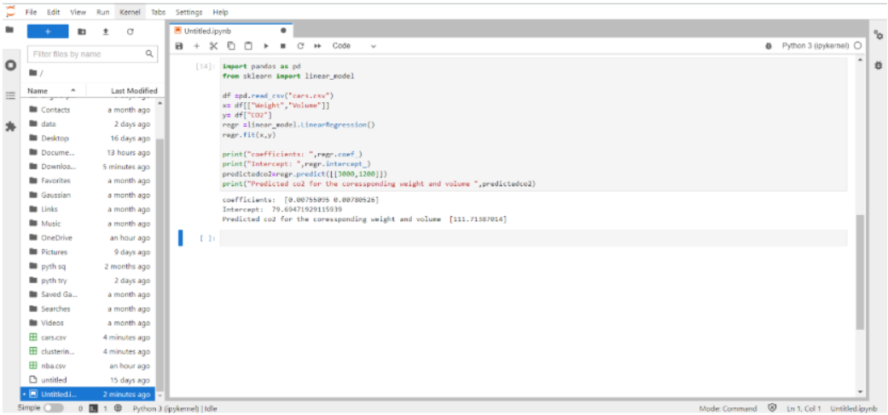

# Implementation of Multivariate Linear Regression
## Aim
To write a python program to implement multivariate linear regression and predict the output.
## Equipment’s required:
1.	Hardware – PCs
2.	Anaconda – Python 3.7 Installation / Moodle-Code Runner
## Algorithm:
### Step1
<br>
Import panda

### Step2
<br>
Import linear model from sklearn

### Step3
<br>
Read the file cars.csv

### Step4
<br>
Assign the values for x and y as required

### Step5
<br>
Create the linearRegression model and predict the output

## Program:
```
#DEVELOPED BY: thrikeswar p
#REG NO: 212222230162
import pandas as pd
from sklearn import linear_model
df =pd.read_csv("cars.csv")
x= df[["Weight","Volume"]]
y= df["CO2"]
regr =linear_model.LinearRegression()
regr.fit(x,y)
print("coefficients: ",regr.coef_)
print("Intercept: ",regr.intercept_)
predictedco2=regr.predict([[3000,1200]])
print("Predicted co2 for the coressponding weight and volume ",predictedco2)
```
## Output:
<br>

## Result
Thus the multivariate linear regression is implemented and predicted the output using python program.
